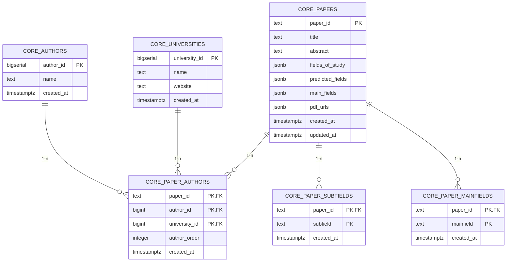

# Tài liệu Cấu trúc Cơ sở dữ liệu (Database Schema)

Tài liệu này mô tả chi tiết cấu trúc các bảng, trường dữ liệu (columns), và các mối quan hệ (references/foreign keys) trong cơ sở dữ liệu, bao gồm hai schema chính là `staging` và `core`.

## 1. Sơ đồ Thực thể - Liên kết (ER Diagram)

Dưới đây là sơ đồ thể hiện các bảng và mối quan hệ giữa chúng trong schema `core`.

## 2. Chi tiết các bảng trong `core` schema

Schema `core` chứa dữ liệu đã qua xử lý, chuẩn hóa và được thiết lập các ràng buộc toàn vẹn dữ liệu (Primary Key, Foreign Key).

### 2.1. `core.papers`

Lưu trữ thông tin chính của các bài báo khoa học.

* `paper_id` (TEXT) - **PRIMARY KEY**: Mã định danh duy nhất của bài báo.
* `title` (TEXT): Tiêu đề bài báo.
* `abstract` (TEXT): Tóm tắt bài báo.
* `fields_of_study` (JSONB): Lĩnh vực nghiên cứu.
* `predicted_fields` (JSONB): Lĩnh vực được dự đoán.
* `main_fields` (JSONB): Lĩnh vực chính.
* `pdf_urls` (JSONB): Các đường dẫn tới file PDF.
* `created_at` (TIMESTAMPTZ): Thời gian tạo bản ghi.
* `updated_at` (TIMESTAMPTZ): Thời gian cập nhật bản ghi.

### 2.2. `core.authors`

Lưu trữ thông tin về các tác giả.

* `author_id` (BIGSERIAL) - **PRIMARY KEY**: Mã định danh duy nhất của tác giả (Tự động tăng).
* `name` (TEXT) - **UNIQUE**: Tên của tác giả.
* `created_at` (TIMESTAMPTZ): Thời gian tạo bản ghi.

### 2.3. `core.universities`

Lưu trữ thông tin về các trường đại học/tổ chức nghiên cứu.

* `university_id` (BIGSERIAL) - **PRIMARY KEY**: Mã định danh duy nhất của trường/tổ chức (Tự động tăng).
* `name` (TEXT) - **UNIQUE**: Tên trường đại học/tổ chức.
* `website` (TEXT): Địa chỉ website.
* `created_at` (TIMESTAMPTZ): Thời gian tạo bản ghi.

### 2.4. `core.paper_authors`

Bảng trung gian thể hiện mối quan hệ nhiều-nhiều (N-N) giữa bài báo, tác giả và trường đại học.

* `paper_id` (TEXT) - **PK, FOREIGN KEY** tham chiếu tới `core.papers(paper_id)` (ON DELETE CASCADE).
* `author_id` (BIGINT) - **PK, FOREIGN KEY** tham chiếu tới `core.authors(author_id)` (ON DELETE CASCADE).
* `university_id` (BIGINT) - **PK, FOREIGN KEY** tham chiếu tới `core.universities(university_id)` (ON DELETE CASCADE).
* `author_order` (INTEGER): Thứ tự của tác giả trong bài báo.
* `created_at` (TIMESTAMPTZ): Thời gian tạo bản ghi.

### 2.5. `core.paper_subfields`

Bảng trung gian thể hiện các lĩnh vực phụ của một bài báo.

* `paper_id` (TEXT) - **PK, FOREIGN KEY** tham chiếu tới `core.papers(paper_id)` (ON DELETE CASCADE).
* `subfield` (TEXT) - **PK**: Tên lĩnh vực phụ.
* `created_at` (TIMESTAMPTZ): Thời gian tạo bản ghi.

### 2.6. `core.paper_mainfields`

Bảng trung gian thể hiện các lĩnh vực chính của một bài báo.

* `paper_id` (TEXT) - **PK, FOREIGN KEY** tham chiếu tới `core.papers(paper_id)` (ON DELETE CASCADE).
* `mainfield` (TEXT) - **PK**: Tên lĩnh vực chính.
* `created_at` (TIMESTAMPTZ): Thời gian tạo bản ghi.

---

## 3. Chi tiết các bảng trong `staging` schema

Schema `staging` dùng để chứa dữ liệu thô (raw data) được nạp vào ban đầu, chưa qua chuẩn hóa chuyên sâu. Các bảng này không có Primary Key hay Foreign Key nhằm tối ưu hiệu suất nạp dữ liệu.

### 3.1. `staging.raw_papers`

* `paper_id` (TEXT) - *Được đánh Index*: Mã bài báo.
* `title` (TEXT): Tiêu đề.
* `abstract` (TEXT): Tóm tắt.
* `fields_of_study_raw` (TEXT): Dữ liệu thô lĩnh vực nghiên cứu.
* `predicted_fields_raw` (TEXT): Dữ liệu thô lĩnh vực dự đoán.
* `main_fields_raw` (TEXT): Dữ liệu thô lĩnh vực chính.
* `pdf_urls_raw` (TEXT): Dữ liệu thô URLs.
* `authors_raw` (TEXT): Dữ liệu thô danh sách tác giả.
* `source_csv` (TEXT): Nguồn file CSV chứa dữ liệu.
* `loaded_at` (TIMESTAMPTZ): Thời điểm dữ liệu được nạp vào hệ thống.

### 3.2. `staging.raw_affiliations`

* `paper_id` (TEXT) - *Được đánh Index*: Mã bài báo.
* `author_name` (TEXT): Tên tác giả.
* `affiliations_json` (JSONB): Dữ liệu JSON chứa thông tin đơn vị công tác.
* `source_json` (TEXT): Nguồn chuỗi JSON.
* `loaded_at` (TIMESTAMPTZ): Thời điểm nạp dữ liệu.

---

## 4. Các Views & Materialized Views hỗ trợ báo cáo

Cơ sở dữ liệu cung cấp các cấu trúc view để thống kê xếp hạng mức độ đóng góp của các trường đại học:

* **`core.mv_subfield_university_ranking`** (Materialized View): Tính toán và xếp hạng điểm đóng góp của các tổ chức theo từng lĩnh vực phụ (`subfield`).
* **`core.mv_overall_university_contribution`** (Materialized View): Tính toán và xếp hạng tổng điểm đóng góp của các tổ chức trên toàn bộ hệ thống.
* **`core.v_subfield_university_ranking`** (View): Cung cấp thông tin tên trường đại học vào thống kê xếp hạng theo lĩnh vực phụ.
* **`core.v_overall_university_ranking`** (View): Cung cấp thông tin tên trường đại học vào thống kê xếp hạng tổng thể.
